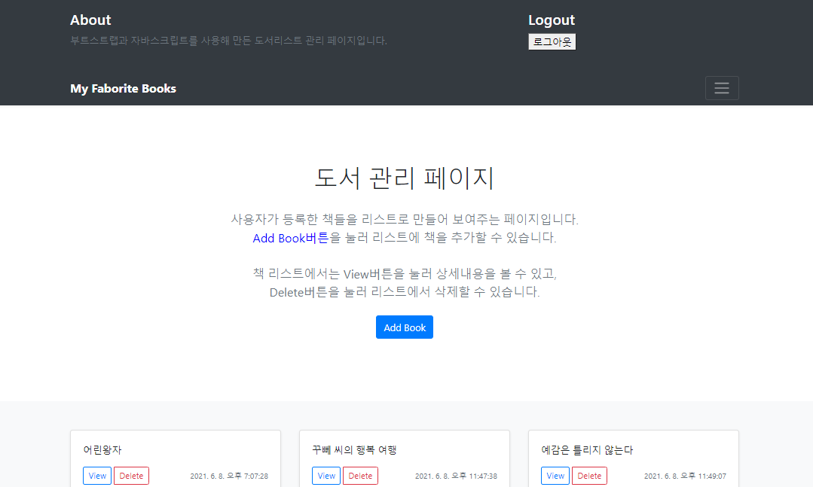

# 도서리스트 관리페이지 만들기

html, css, js를 이용해서 홈페이지를 만들었습니다.

## HTML

전체적인 html구조는 [부트스트랩의 예제](https://getbootstrap.kr/docs/5.0/examples/album/)를 사용했습니다.

## JavaScript

서버는 만들어져있는 서버와 아이디정보를 가지고 로그인했습니다. 
서버와의 통신은 axios를 사용했습니다.

---

동작설명

1. 로그인을 위한 로그인화면이 가장먼저 나타납니다. 
   

2. 로그인을 성공하면 토큰값을 받아오고 index페이지가 나타납니다. 

   
   간략한 홈페이지 설명과 책을 추가할 수 있는 Add Book버튼이 있습니다. 
   아래에는 로그인한 계정에 저장되어있는 책 리스트를 보여줍니다. 

3. 화면 가장 위 오른쪽의 토글버튼을 누르면 로그아웃 버튼이 나타납니다.
   

4. Add Book버튼을 누르면 책을 추가하기 위해 책 상세정보를 작성하는 창으로 넘어갑니다. 

   
   모든 입력창을 입력한 뒤 Save버튼을 눌러 axios.post로 책의 정보를 보냅니다. 
   책이 성공적으로 추가되면 index페이지로 이동하고 추가된 책 리스트가 보여집니다. 

5. index페이지에서 View버튼을 누르면 해당 책의 상세정보를 보여줍니다. 
   상세정보에서 Edit를 누르면 상세정보를 변경할 수 있는 edit페이지로 넘어가고,  
   Delete버튼을 누르면 책이 리스트에서 삭제되고 index페이지로 넘어갑니다.  
     
   edit페이지
   
   책 추가하는 화면과 비슷하지만 여기서는 입력창에 값이 이미 작성된 값으로 채워져있고, 
   내용을 수정한 후 Save버튼을 누르면 수정된 내용으로 저장됩니다. 
